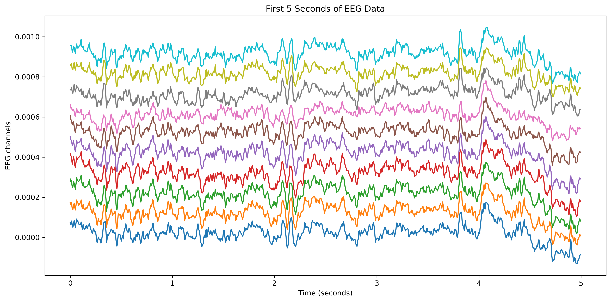
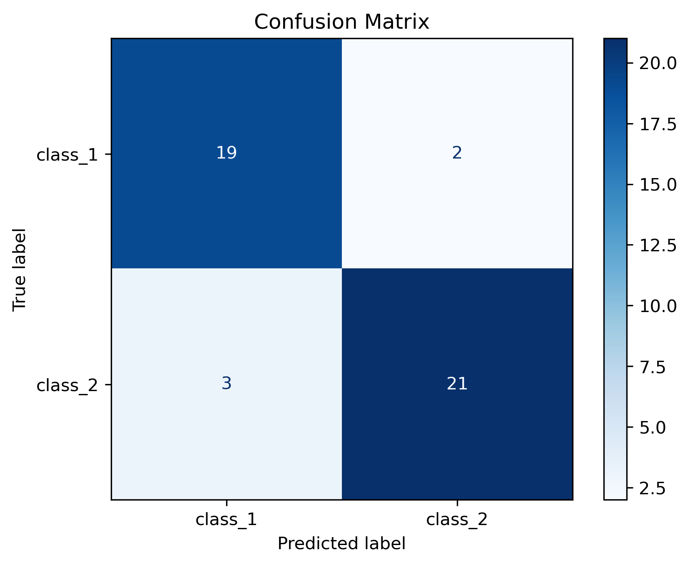

# EEG Motor Imagery Classification
This project builds an end-to-end brain-computer interfance (BCI) pipeline for classifying motor imagery EEG signals. Using real EEG recordings from the PhysioNet EEG Motor Movement/ Imagery Dataset, I preprocess neural signals, extract motor imagery epochs, and train a CSP + LDA classifier to distinguish between two imagined movement conditions.

## Project Motivation
Motor imagery BCIs aim to decode intended movement from brain activity. These systems are relevant to neurotechnology applications such as assistive communication, neurorehabilitation, and neural interface development.

This project was designed as a complete EEG decoding pipeline, emphasizing interpretability and standard BCI methods rather than deep learning.

## Project Goal
The goal is to classify two motor imagery conditions from EEG recordings using signal preprocessing, epoch extraction, Common Spatial Patterns (CSP), and Linear Discriminant Analysis (LDA)

## Dataset
This project uses Subject 1 from the PhysioNet EEG Motor Movement/Imagery Dataset

Runs used:
- S001R06
- S001R10
- S001R14

These runs contain motor imagery EEG recordings with 64 EEG channels sampled at 160 Hz. 

Raw EEG data is not included in this repository. Users should download the dataset directly from PhysioNet and place the EDF files in the local data/ folder.

## Methods

The analysis pipeline includes:

1. Loaded EEG data from EDF files
2. Inspecting recording metadata and channel structure
3. Visualizing raw EEG signals
4. Combining multiple motor imagery runs
5. Band-pass filtering from 8-30 Hz
6. Extracted 4-second motor imagery epochs
7. Trained a Common Spatial Patterns (CSP) + Linear Discriminant Analysis (LDA) classifier
8. Evaluated performance using 5-fold stratified cross-validation
9. Visualizing model performance with a confusion matrix

## Results
The CSP + LDA model achieved approximately:

**Mean Cross-Validation Accuracy: 88.9%**

This result suggests that the EEG recordings contain discriminative patterns between the two motor imagery classes. Because this analysis uses only one subject and a small number of trials, results should be interpreted as a proof-of-concept rather than a production-ready BCI decoder. 

## Figures

### Raw EEG Visualization


### Confusion Matrix 


### CSP Spatial Patterns


## Project Structure 

```text
eeg-motor-imagery-classification/
│
├── notebooks/
│   ├── 01_dataset_exploration.ipynb
│   ├── 02_preprocessing.ipynb
│   ├── 03_feature_extraction.ipynb
│   └── 04_classification.ipynb
│
├── figures/
│   ├── raw_eeg_subject1.png
│   ├── confusion_matrix.png
│   └── csp_patterns.png
│
├── README.md
└── .gitignore
```

## Tools Used

-Python
-MNE-Python
-NumPy
-Matplotlib
-scrikit-learn
-Jupyter Notebook
-Git
-GitHub